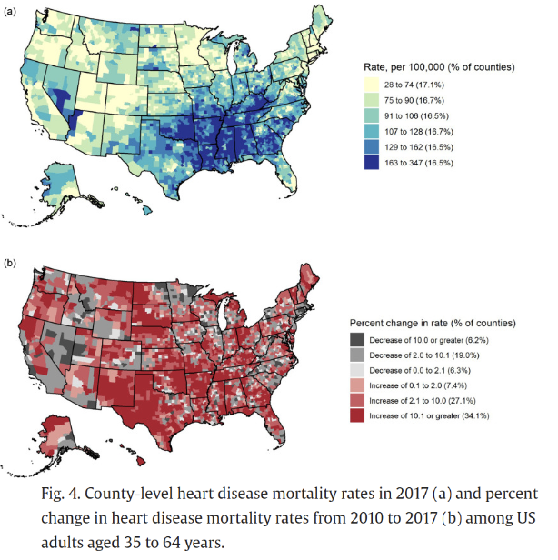

# QBS181 Project

Repository for the final QBS181 project. This project involves data cleaning, imputation, and prediction scripts for heart disease datasets.

## Team Members
- Biratal
- Haoyang
- Kevin
- Rob

## Description
Heart disease is the leading cause of death for men, women, and people of most racial and ethnic groups, accounting for approximately 1 in every 5 deaths in 2022 in the United States (, 702,880 people died from heart disease)
Heart disease cost about $252.2 billion from 2019 to 2020.2This includes the cost of healthcare services, medicines, and lost productivity due to death.
From 2009-2019, around 6% prevalence in the total population with men more likely to have disease compared to woman
Prevalence of heart disease increases as you age

### Cleaned Data
Contains cleaned datasets from various sources including Framingham, Kaggle, Mendeley, and UCI.

### Data Cleaning Scripts
Jupyter notebooks for cleaning and processing the datasets:
- `MergingDF.ipynb`: Script for merging dataframes.
- `Processing_UCI.ipynb`: Script for processing the UCI heart disease dataset.

### Data Dictionary
Contains data dictionaries for the datasets used:
- `Framingham_DD.csv`
- `Mendeley_dataset.csv`
- `Mendeley1_DD.csv`
- `UCI_DD.csv`

### Imputed Data Algorithms
Scripts for data imputation:
- `181Project_ML_SynData.Rmd`: R Markdown file for data imputation using MICE method.
- `synthesis_data.ipynb`: Jupyter notebook for synthesizing data.

### Prediction Scripts
Contains scripts for predicting heart disease:
- `Prediction.ipynb`: Jupyter notebook for running prediction models.

## Usage

### Data Cleaning
To clean the data, run the notebooks in the `Data Cleaning Scripts` directory.

### Data Imputation
To impute missing data, run the scripts in the `Imputed Data Algorithms` directory.

### Prediction
To run predictions, use the `Prediction.ipynb` notebook in the `Prediction Scripts` directory.
